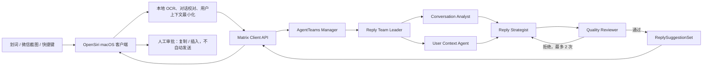

# OpenSiri × AgentTeams 设计

- 状态：Approved for planning
- 日期：2026-08-16
- 目标赛道：GOAI 世界人工智能开源大赛 — Agent Infra
- 产品形态：macOS 系统级 AI 入口 + 独立 AgentTeams 协作后端
- 主场景：识别微信对话截图，结合用户上下文生成经验证的回复建议
- 相关旧方案：`docs/superpowers/plans/2026-08-06-expansion-abbreviation-skill.md`

## 1. 决策摘要

OpenSiri 复用 OpenSiri 的划词、截图、OCR、全局快捷键、弹窗和文本回写能力，
但不在 macOS App 进程内实现自有多 Agent 编排。OpenSiri 作为 AgentTeams 中的
Human 客户端，通过 Matrix 提交结构化任务、订阅协作状态、展示验证证据并执行
人工批准后的文本回写。

首个端到端场景是“微信截图智能回复”：用户通过快捷键截取微信对话，本地 OCR
将截图转成带位置、说话人和置信度的对话结构；OpenSiri 只向 AgentTeams 提交完成
任务所需的对话文本和最小化用户上下文。AgentTeams 中的 Reply Team 由 Team
Leader 协调四个不同职能 Worker，依次完成对话分析、用户上下文解析、候选回复生成
和独立质量验证。用户在 OpenSiri 弹窗中选择、调整并插入回复，首版永不自动发送。

OpenSiri 首发三个用户可见 Product Skill：

1. `wechat-smart-reply`：微信截图智能回复。
2. `selection-rewrite`：选中文本扩写、缩写、润色和语气转换。
3. `screenshot-action-advisor`：截图信息理解、风险识别和行动建议。

## 2. 背景与可行性

### 2.1 现有基础

OpenSiri 已经提供本设计最昂贵的 macOS 平台能力：

- 全局快捷键和系统级操作入口。
- 区域截图和多种 OCR 引擎。
- 划词、剪贴板和当前应用上下文获取。
- 浮动查询窗口、Mini 窗口和 Markdown 结果渲染。
- `ActionManager` 中的文本获取与安全回写流程。
- `AIToolService` 体系中的扩写、缩写、润色和总结参考实现。

AgentTeams 提供独立的协作平面：

- Manager、Team Leader 和 Worker 的角色与生命周期管理。
- 基于 Matrix Room 的人机可见协同。
- Worker、Team、Human 等声明式资源。
- 通过 `Worker.spec.skills` 分发自定义 Skill。
- MinIO/OSS 共享产物存储和 Higress 凭证隔离。

因此本项目的关键工作是定义稳定的客户端—协作后端契约，而不是重新实现截图、OCR
或多 Agent 运行时。

### 2.2 可行性判断

- 初赛方案：高可行。初赛不强制可执行代码，当前设计足以产出完整简介、PPT、
  Agent Identity 清单、Skill 清单和落地路线。
- 复赛最小 Demo：中等偏高可行。范围必须限制为一条微信截图智能回复链路，
  不同时实现全部三个 Product Skill 的完整 UI。
- 产品长期演进：高可行。三个 Product Skill 共用捕获、任务、状态、验证和回写接口，
  后续增加 Skill 不需要增加新的客户端—后端协议。

## 3. 目标与非目标

### 3.1 目标

- 让用户在任意 macOS 应用中通过快捷键调用 OpenSiri。
- 识别微信对话截图的文字、气泡顺序和说话人归属。
- 结合用户明确配置的关系、语气、语言和承诺偏好生成回复。
- 通过至少三个不同职能 Agent 完成真正的任务拆解与协同；本设计使用四个 Worker。
- 显示任务分解、Agent 状态、失败回退、验证结果和执行证据。
- 把高风险动作放在人类审批边界内，首版只复制或插入文本。
- 将关键能力发布为有版本、Schema、失败处理和测试用例的可复用 Skill。
- 提供可运行、可验证、可审计、可复现的复赛工程材料。

### 3.2 非目标

- 首版不自动点击微信发送按钮或模拟回车。
- 首版不读取微信数据库、注入微信进程或绕过系统权限。
- 首版不将完整用户画像或完整历史对话上传给所有 Worker。
- 首版不 fork 或修改 AgentTeams Controller。
- 首版不实现云端多租户、付费、组织管理或移动端客户端。
- 复赛前不要求三个 Product Skill 都达到相同完成度；主 Skill 必须完整，其余两个
  提供工程合同、样例和至少一条可重放验证链路。

## 4. 产品体验

### 4.1 主流程

1. 用户在微信中按下 OpenSiri 截图快捷键。
2. 用户框选一段连续对话。
3. OpenSiri 在本地完成 OCR、气泡排序和说话人初步分类。
4. 弹窗进入“截图校对”状态，显示对话结构、置信度和本次用户上下文。
5. 用户确认后，OpenSiri 生成 `OpenSiriTaskEnvelope` 并发送到 Matrix Room。
6. OpenSiri 显示四个简化的 Agent 状态节点；详细 Matrix 事件按需展开。
7. Reply Team 返回三个不同策略的候选回复及验证结果。
8. 用户选择候选，也可以输入“更随意”“不要承诺具体时间”等修订指令。
9. 用户选择复制，或在授权 Accessibility 后插入当前微信输入框。
10. OpenSiri 保存最终选择和人工修改摘要，但不记录或发送消息内容到无关系统。

### 4.2 弹窗状态

```text
idle
  → capturing
  → reviewing_capture
  → submitting
  → running
  → awaiting_user_approval
  → inserting_or_copying
  → completed
```

异常状态为 `needs_capture_correction`、`backend_unavailable`、
`needs_human_input` 和 `failed`。每个异常状态都必须给出可执行的恢复动作。

### 4.3 结果展示

默认展示三个候选：简洁、友好和稳妥。每个候选包含：

- 回复文本。
- 策略标签。
- 一句选择理由。
- 隐私、事实、语气和承诺风险标志。
- 验证状态。

数值评分仅在展开验证证据后显示；默认 UI 使用“通过”“需注意”“拒绝”，避免把
未校准的 LLM 分数呈现为客观概率。

## 5. 系统架构

### 5.1 双平面边界



体验平面由 Swift/SwiftUI/AppKit 实现；协作平面使用独立部署的 AgentTeams v1.2.2。
初版直接使用 Matrix 协议，不增加 OpenSiri Bridge。生产化演进可以在两者之间增加
Bridge，以统一认证、限流、Schema 注册和多客户端接入，但 Bridge 不属于复赛最小
范围。

### 5.2 Matrix 集成

OpenSiri 使用标准 Matrix `m.room.message` 发送人类可读摘要和机器可读任务载荷，
避免修改 AgentTeams：

```text
OPENSIRI_TASK_V1
task_id: <uuid>
skill_id: wechat-smart-reply
body: { "schemaVersion": "1.0", "taskID": "...", "conversation": { } }
```

Reply Team 的 Skill 规定所有结构化状态使用以下前缀发送：

```text
OPENSIRI_EVENT_V1 {"taskID":"...","state":"verifying","agent":"quality-reviewer"}
```

最终结果使用 `OPENSIRI_RESULT_V1` 事件，包含内联小结果或 MinIO/OSS 产物引用。
OpenSiri 只解析匹配版本、任务 ID 和 JSON Schema 的事件；其他 Matrix 消息作为人类
协作内容展示，不进入客户端状态机。

### 5.3 存储边界

- macOS Keychain：Matrix access token 和本地数据加密密钥。
- macOS Application Support：用户偏好、最小化用户画像和本地任务缓存；敏感字段
  使用 Keychain 管理的密钥加密。
- Matrix：协作事件、人工消息、状态变化和审批记录。
- MinIO/OSS：较大的结构化产物、验证报告和匿名运行证据。
- 首版不增加独立业务数据库。

## 6. Agent Identity

### 6.1 AgentTeams Manager

- 身份：全局协作管理者。
- 输入：OpenSiri Human 提交的任务。
- 输出：选定 Team 的委派和全局任务状态。
- 权限：Team/Worker 生命周期和 Matrix 房间管理。
- 边界：不直接生成最终回复。

### 6.2 Reply Team Leader

- 身份：微信回复任务的团队协调者。
- 输入：通过 Schema 校验的 `OpenSiriTaskEnvelope`。
- 输出：任务拆解、Worker 委派、重试和汇总结果。
- 权限：向 Team Worker 发送任务，读取 Worker 产物。
- 边界：不替代 Reviewer，也不绕过人工审批。

### 6.3 Conversation Analyst

- 身份：对话结构与意图分析者。
- 输入：`ConversationSnapshot`。
- 输出：`ConversationAnalysis`，包含说话人、关系线索、意图、情绪、待回应事项和
  OCR 疑点。
- 边界：不生成最终回复；发现结构歧义时返回 `needs_capture_correction`。

### 6.4 User Context Agent

- 身份：用户上下文最小化与策略解析者。
- 输入：`UserContext` 和任务目的。
- 输出：`ReplyConstraints`，只包含本任务相关偏好。
- 边界：不读取未授权记忆；不把无关画像发送给其他 Worker。

### 6.5 Reply Strategist

- 身份：候选回复生成者。
- 输入：`ConversationAnalysis` 和 `ReplyConstraints`。
- 输出：三个具有策略差异的 `ReplyCandidate`。
- 边界：不自行批准候选；不得声称用户未提供的事实或承诺。

### 6.6 Quality Reviewer

- 身份：独立质量与安全验证者。
- 输入：原始任务、分析结果、约束和候选回复。
- 输出：`VerificationReport`，包含确定性检查、语义检查和 reason code。
- 边界：不修改原始任务；不直接向用户发布未经 Team Leader 汇总的结果。

四个 Worker 具有不同输入、输出、工具和禁止事项。即使评审不把 Manager 与 Team
Leader 计入不同职能 Agent，本设计仍超过赛道要求的三个不同职能 Agent。

## 7. Skill 工程体系

### 7.1 Product Skill

Product Skill 是用户在 OpenSiri 中选择的完整工作流：

| Skill ID | 输入 | 输出 | 首版完成度 |
|---|---|---|---|
| `wechat-smart-reply` | 微信截图、对话结构、用户上下文 | 回复候选与验证报告 | 完整端到端 |
| `selection-rewrite` | 选中文本、改写意图 | 改写候选 | 合同、样例、可重放链路 |
| `screenshot-action-advisor` | 截图上下文、用户目标 | 摘要、风险、行动建议 | 合同、样例、可重放链路 |

### 7.2 Worker Skill

Worker Skill 是可分发给不同 Worker 的原子能力：

- `parse-conversation`
- `resolve-user-context`
- `draft-reply-candidates`
- `verify-reply-candidates`
- `rewrite-selected-text`
- `analyze-screenshot-actions`

一个 Product Skill 编排多个 Worker Skill；同一个 Worker Skill 可以被不同 Product
Skill 复用。

### 7.3 Skill 包结构

```text
infra/agentteams/skills/<skill-id>/
├── SKILL.md
├── references/input.schema.json
├── references/output.schema.json
├── references/evaluation-rubric.md
├── scripts/validate-result.py
└── tests/cases/
```

每个 `SKILL.md` 必须明确：

- 语义版本和兼容范围。
- 用途、调用条件和禁止调用条件。
- 输入输出 Schema。
- 所需 Agent、工具、权限和数据范围。
- 超时、重试、幂等和失败降级。
- 安全边界和 Prompt Injection 处理。
- 验证方式、评价指标和回归样例。
- 发布、回滚和废弃策略。

Skill 通过 `Worker.spec.skills` 分发；首版不修改 AgentTeams 内置 Skill。

## 8. 数据契约

### 8.1 TaskEnvelope

```swift
struct OpenSiriTaskEnvelope: Codable, Sendable {
    let schemaVersion: String
    let taskID: UUID
    let skillID: String
    let skillVersion: String
    let conversation: ConversationSnapshot?
    let textSelection: String?
    let screenshotContext: ScreenshotContext?
    let userContext: UserContext
    let privacyPolicy: PrivacyPolicy
    let requestedReplyStyles: [ReplyStyle]
    let createdAt: Date
}
```

三个输入字段 `conversation`、`textSelection` 和 `screenshotContext` 中必须且只能有
一个非空。客户端在提交 Matrix 消息前执行这一约束。

### 8.2 ConversationSnapshot

```swift
struct ConversationSnapshot: Codable, Sendable {
    let application: String
    let turns: [ConversationTurn]
    let detectedLanguage: String?
    let overallConfidence: Double
    let rawImageReference: String?
}

struct ConversationTurn: Codable, Sendable {
    let id: UUID
    let speaker: ConversationSpeaker
    let text: String
    let normalizedBoundingBox: CGRect
    let confidence: Double
}
```

`normalizedBoundingBox` 使用截图宽高归一化到 `0...1` 的坐标，避免分辨率耦合。
`rawImageReference` 默认为空；只有用户明确同意视觉模型处理时才生成限时引用。

### 8.3 UserContext

```swift
struct UserContext: Codable, Sendable {
    let relationshipLabel: String?
    let preferredTones: [String]
    let languagePreferences: [String]
    let avoidPatterns: [String]
    let commitmentPolicy: String?
    let relevantMemorySnippets: [String]
}
```

客户端按任务选择相关字段，不发送完整用户档案。`relevantMemorySnippets` 首版由用户
显式选择或本地规则选取，不做云端自动长期记忆。

### 8.4 ReplySuggestionSet

```swift
struct ReplySuggestionSet: Codable, Sendable {
    let schemaVersion: String
    let taskID: UUID
    let candidates: [ReplyCandidate]
    let verificationReport: VerificationReport
    let evidenceReferences: [String]
    let skillVersions: [String: String]
}
```

每个候选必须有稳定 ID、文本、策略、理由、风险标志和验证状态。结果缺少三个候选时
可以通过 Schema，但必须在验证报告中说明原因；客户端不得伪造缺失候选。

## 9. 状态、失败与恢复

### 9.1 协作状态

```text
accepted
  → decomposed
  → analyzing
  → drafting
  → verifying
  → awaiting_user_approval
  → completed
```

验证拒绝时从 `verifying` 转到 `revision_required`，携带 reason code 返回
`drafting`。最多自动重试两次；第三次拒绝转为 `needs_human_input`。

### 9.2 失败矩阵

| 失败 | 处理 |
|---|---|
| OCR 置信度低或说话人不明确 | 本地暂停，要求用户校对 |
| 用户上下文缺失 | 使用通用策略并明确标记未个性化 |
| Matrix/AgentTeams 不可用 | 本地缓存任务、指数退避，不生成伪多 Agent 结果 |
| Worker 超时或退出 | Team Leader 重试或重新委派，记录状态 |
| 输出 Schema 无效 | 校验脚本拒收并保留原始输出作为证据 |
| Reviewer 拒绝 | 带 reason code 回退，最多两次 |
| 两次回退仍失败 | 转人工处理 |
| 截图包含 Prompt Injection | 作为不可信数据，不允许修改系统指令或工具策略 |
| 用户请求自动发送 | 首版拒绝，只允许复制或插入 |

任务使用 `taskID` 作为幂等键。OpenSiri 重发同一任务时必须复用 ID；Team Leader
读取已有状态和产物，避免重复生成或重复写入。

## 10. 隐私与安全

- 原始截图默认不离开 Mac。
- 本地 OCR 保留文字和布局，远端只获得完成任务所需的结构化内容。
- OCR 低置信度且需要视觉模型时，必须弹出逐次授权；引用带有效期。
- 提交前可按本地规则脱敏手机号、邮箱、账号和其他用户配置字段。
- Matrix access token 保存在 Keychain。
- 模型和 MCP 真实密钥留在 Higress；Worker 只获得受限 consumer token。
- User Context Agent 只输出本任务相关约束，不广播完整用户画像。
- 所有截图文本均标记为不可信数据，禁止其中指令覆盖 Agent 或 Skill 规则。
- Accessibility 只用于向当前输入控件插入文本，不模拟发送键或点击发送按钮。
- 高风险动作必须有显式人工确认、可取消状态和审计事件。

## 11. 可观察、评测与测试

### 11.1 运行证据

- Matrix Timeline：接收、委派、Worker 状态、重试、验证和人工审批。
- MinIO/OSS Artifact：输入摘要、Skill 版本、候选、验证报告和最终选择。
- Metrics/Trace：端到端耗时、Worker 失败率、首次验证通过率、用户采用率和人工
  改写率。

复赛最小实现覆盖“共享状态管理”和“轨迹可观察”两项上下文能力。RAG 和长期 Agent
记忆属于后续能力，不为满足工具数量而加入。

### 11.2 目标指标

| 指标 | 首版目标 |
|---|---:|
| 原始截图默认上传率 | 0% |
| 高风险动作人工确认覆盖率 | 100% |
| Agent、Skill、审批事件 Trace 完整率 | 100% |
| 50 组匿名或合成截图的对话顺序识别准确率 | ≥ 90% |
| 正常端到端任务完成率 | ≥ 90% |
| 正常任务 30 秒内返回可选回复的比例 | ≥ 90% |

### 11.3 测试层次

1. Swift 单元测试：气泡排序、说话人分类、TaskEnvelope 约束、状态 reducer、脱敏。
2. Skill 合同测试：输入输出 Schema、缺失画像、Prompt Injection、超时和拒绝回退。
3. AgentTeams 集成测试：Docker 中 apply CR、replay 任务、检查 Matrix 事件和产物。
4. macOS 端到端测试：截图、校对、提交、协作、候选、复制和插入。
5. Demo 异常测试：主动制造 OCR 错误或 Reviewer 拒绝，展示恢复和审计证据。

## 12. 仓库边界

### 12.1 Swift 客户端

```text
OpenSiri/Swift/Feature/OpenSiri/
├── Capture/
├── Conversation/
├── UserContext/
├── Task/
├── AgentTeams/
└── View/
```

- `Capture/`：截图、OCR 结果适配、气泡排序和说话人分类。
- `Conversation/`：对话模型和校对逻辑。
- `UserContext/`：本地用户上下文选择、存储和最小化。
- `Task/`：TaskEnvelope、Result、事件和状态 reducer。
- `AgentTeams/`：Matrix 认证、发送、同步和事件解析。
- `View/`：新弹窗、对话校对、Agent 进度、候选回复和审批。

### 12.2 AgentTeams 工程

```text
infra/agentteams/
├── manifests/
├── skills/
├── fixtures/
└── scripts/
```

这些文件是独立部署、测试和分发材料，不进入 Xcode build phase。AgentTeams 作为
外部运行时依赖，不把其源码 vendor 到 OpenSiri 工程。

### 12.3 旧计划迁移

旧计划中以下内容可继续复用或改写：

- 扩写、缩写和润色 Prompt 转为 `selection-rewrite` Worker Skill 样例。
- 全局快捷键、菜单和 `ActionManager` 的文本回写骨架。
- Markdown/结构化结果渲染的思路。

以下内容被本设计取代：

- 单体 `SkillService` 负责所有 Skill 调用。
- 全局 `activeSkillID` 决定并发请求行为。
- 仅使用本地 `SkillStore` 作为运行时事实来源。
- 一个 AI 服务直接生成并展示结果的单 Agent 路径。

旧计划保留为历史输入，不直接执行；新的实施计划单独创建。

## 13. 实施分期

### P0：初赛材料（2026-08-16）

- 500 字以内作品简介。
- 方案 PPT/PDF。
- Agent Identity 清单。
- 三个 Product Skill 清单和核心 Worker Skill 清单。
- AgentTeams 映射、隐私边界、失败流程、开源计划和复赛路线。

初赛材料诚实标记当前进展，不把设计稿描述为已运行代码。

### P1：本地垂直切片（2026-08-17 至 2026-08-20）

- 截图到本地 OCR。
- 气泡排序与说话人分类。
- ConversationSnapshot 和 TaskEnvelope。
- 使用 fixture 数据展示完整新弹窗。

### P2：AgentTeams 基线（2026-08-21 至 2026-08-24）

- 固定 AgentTeams v1.2.2。
- Reply Team 和四个 Worker CR。
- Worker Skill 包、Schema 和验证脚本。
- Matrix replay 完成一条结构化任务。

### P3：端到端集成（2026-08-25 至 2026-08-28）

- Swift Matrix 认证、发送和 sync。
- Matrix 事件到 OpenSiri 状态机的映射。
- 结构化结果解析和候选回复展示。
- 复制和插入当前输入框。

### P4：验证与证据（2026-08-29 至 2026-08-31）

- 50 组匿名或合成截图 fixture。
- Swift、Skill、AgentTeams 和端到端测试。
- OCR 校对、Worker 超时和 Reviewer 拒绝异常演示。
- Trace、Metrics 和运行报告。

### P5：复赛交付（2026-09-01 至 2026-09-03）

- 更新方案 PPT/PDF。
- 可执行 AgentTeams 代码包。
- 本地部署和测试说明。
- Demo 视频和样例输入输出。
- 2026-09-03 只做修复、缓冲和提交，不增加功能。

## 14. 初赛 PPT 结构

1. **OpenSiri：项目定位** — 系统级 AI 入口与可信多 Agent 执行后端。
2. **用户痛点** — 跨应用上下文割裂、截图内容难复用、单模型回复不可验证。
3. **主场景** — 微信截图到个性化回复的完整用户旅程。
4. **为什么需要多 Agent** — 分析、用户上下文、生成和验证的职责冲突与分离。
5. **双平面架构** — OpenSiri macOS 客户端和 AgentTeams 协作后端。
6. **Agent Identity** — Manager、Team Leader 和四个 Worker 的职责与权限。
7. **三个内置 Skill** — Product Skill 与 Worker Skill 的两层工程体系。
8. **闭环与异常** — 状态机、验证回退、人工审批和失败处理。
9. **OpenSiri 弹窗** — OCR 校对、Agent 进度、候选、证据和安全回写。
10. **安全与验证** — 默认不上传截图、凭证隔离、Trace 和量化指标。
11. **可行性与开源路线** — 现有基础、复赛分期、许可证和长期演进。

## 15. 开源与品牌

- OpenSiri 派生客户端继续采用 GPL-3.0，并保留原项目版权、许可证和修改说明。
- AgentTeams 作为独立 Apache-2.0 运行时依赖，保留其许可证和第三方声明。
- OpenSiri 仓库增加第三方依赖与许可证清单，不复制 AgentTeams 源码。
- 项目继续使用 `OpenSiri` 名称是已确认的产品决策。
- `Siri` 是 Apple 注册商标；项目不得使用 Apple Logo，不得声称与 Apple 存在授权、
  赞助或隶属关系，并在 README/PPT 中加入独立项目声明。
- 上述声明不能消除名称本身的商标风险；公开发布、商业化或上架前应取得专业法律
  意见。本设计将该风险列为已知且由项目方接受的风险。

## 16. 备选方案与取舍

### 16.1 Matrix 原生薄客户端（采用）

优点是最少修改 AgentTeams、协作证据天然可见、能在复赛周期内完成。缺点是 Swift
需要处理 Matrix 登录、同步、断线恢复和事件版本。

### 16.2 OpenSiri Bridge（后续）

Bridge 可以统一认证、Schema、限流、Trace 和多端接入，但增加一个服务的部署与
维护成本。它是生产化演进，不属于复赛最小范围。

### 16.3 Fork AgentTeams（不采用）

深度修改 Controller 或插件平台带来最高控制力，但工作量、升级成本和兼容风险均
超出比赛周期。

## 17. 验收标准

设计进入详细实施计划前必须满足：

- 主场景、双平面边界、Agent Identity 和三个 Product Skill 已经确认。
- TaskEnvelope、结果、状态、失败、隐私和审批边界没有未决字段。
- 旧计划的复用和废弃边界清楚。
- 复赛最小范围可以由一个完整微信回复链路独立验证。
- 初赛 PPT 的每一页都能映射到赛道评分维度。
- 开源许可和 `OpenSiri` 商标风险已明确记录。

本设计满足以上条件，可以进入实施计划阶段。

## 18. 参考资料

- GOAI Agent Infra 赛道：<https://goaihz.com/tracks?track=infra>
- AgentTeams：<https://github.com/agentscope-ai/AgentTeams/>
- AgentTeams 声明式资源管理：
  <https://github.com/agentscope-ai/AgentTeams/blob/main/docs/zh-cn/declarative-resource-management.md>
- Apple 商标清单：
  <https://www.apple.com/legal/intellectual-property/trademark/appletmlist.html>
- Apple 第三方商标指南：
  <https://www.apple.com/legal/intellectual-property/guidelinesfor3rdparties.html>
